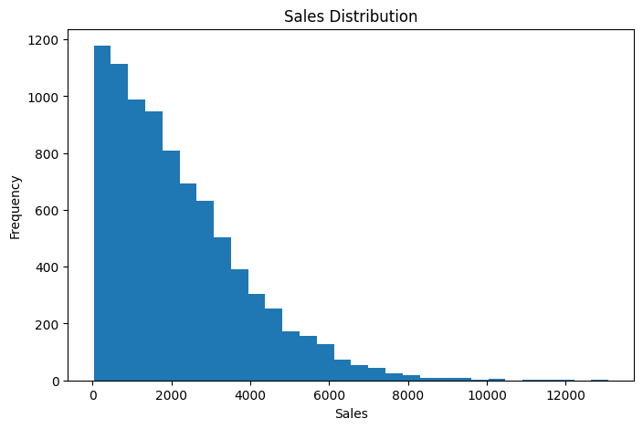
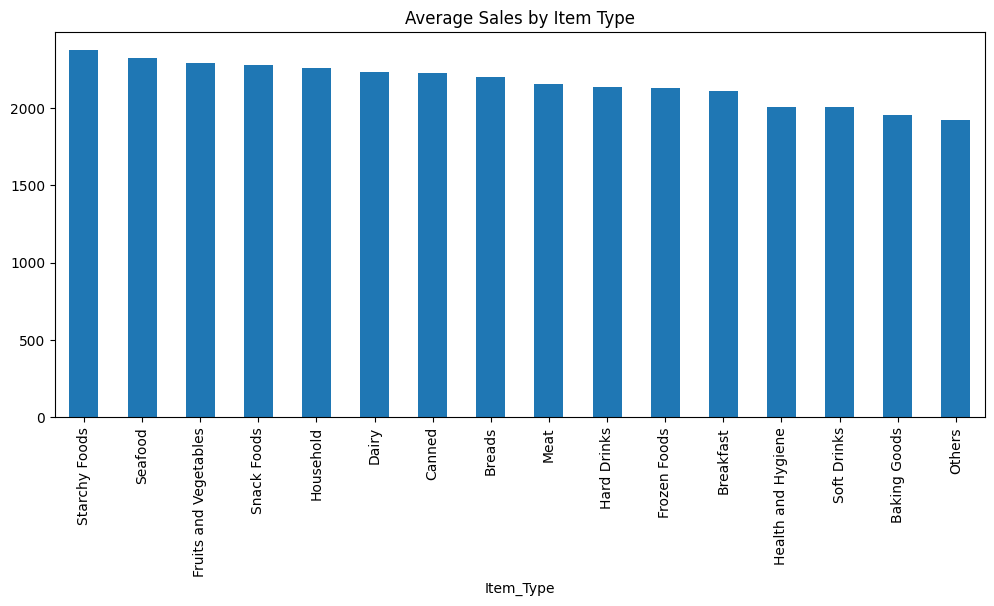

#  GROCERY SALES FORECASTING 📊

> **A Machine Learning project for predicting grocery outlet sales.**

---

## 🌟 Project Overview

This project focuses on predicting the sales of grocery products at different outlets.

The project includes:

- 🔍 Exploratory Data Analysis
- 🧹 Data Preprocessing
- 🔤 Feature Encoding
- 📏 Feature Scaling
- 🤖 Machine Learning Model Training
- 📊 Model Performance Comparison

---

##  Objectives

| 🎯 Objective | Description |
|---|---|
| 📊 Data Analysis | Understand the dataset and identify useful patterns |
| 🔍 EDA | Explore the distribution and relationships in the data |
| 🧹 Preprocessing | Prepare the data for machine learning |
| 🤖 Model Training | Train different regression models |
| 📈 Evaluation | Compare models using MAE, RMSE and R² |

---

##  Dataset

The dataset contains information related to grocery products and their outlet sales.

**Target Variable:** `Item_Outlet_Sales`

The project contains **8,523 observations and 13 columns**.

---
## 🔎 Exploratory Data Analysis

Exploratory Data Analysis was performed to understand the dataset and
identify patterns in grocery outlet sales.

### 📊 Distribution of Item Outlet Sales

The distribution of `Item_Outlet_Sales` was visualized to understand
how the sales values are spread across the dataset.



### 🥫 Average Sales by Item Type

The average sales for different item types were compared to observe
variation in sales across product categories.


---

##  Machine Learning Models

Four regression models were implemented:

| Model | Purpose |
|---|---|
| 🔵 Linear Regression | Baseline regression model |
| 🟢 Decision Tree | Tree-based regression |
| 🟠 Random Forest | Ensemble tree-based model |
| 🟣 XGBoost | Gradient boosting model |

---

## 📈 Model Comparison

| Model | MAE | RMSE | R² |
|---|---:|---:|---:|
| Linear Regression | 847.97 | 1129.81 | 0.5304 |
| Decision Tree | 1031.18 | 1498.63 | 0.1737 |
| Random Forest | 748.42 | 1070.14 | 0.5787 |
| XGBoost | 735.14 | 1053.76 | 0.5915 |

---

##  Project Workflow

```text
 Dataset
     ↓
 Exploratory Data Analysis
     ↓
 Data Preprocessing
     ↓
Feature Encoding
     ↓
 Feature Scaling
     ↓
Train-Test Split
     ↓
 Model Training
     ↓
Model Evaluation
     ↓
Comparison of Results
